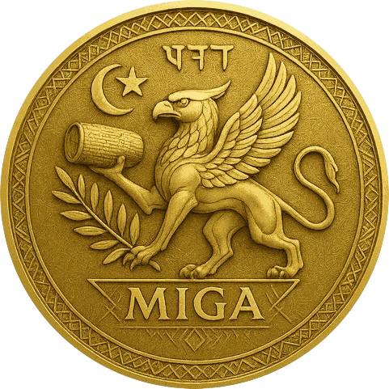

# MIGA — Make Iran Great Again

> **MIGA is not just a token; it is a symbol of hope, peace, and unity — combining ancient Persian legacy with next-generation blockchain technology.**

---

## 🌟 Project Vision

**MIGA** (Make Iran Great Again) is the first smart Jetton on TON blockchain with advanced security and cultural symbolism.  
Inspired by the ancient Cyrus Cylinder (the world's first declaration of human rights), the Griffin, and the olive branch, MIGA stands for peace, rebirth, and enduring legacy for Iran — inviting the world to join hands for a brighter future.

---

## 🔑 Key Features

- **Smart Transfer Guard™**  
  Prevents accidental transfers to incompatible or unsafe addresses.  
  Protects users from the most common Jetton mistakes in the TON ecosystem.

- **Admin Lock (irreversible)**  
  The contract owner can renounce all admin rights, ensuring decentralization and maximum trust.

- **Airdrop Ready**  
  Designed for fair community distribution, events, and future collaborations.

- **Cultural & Symbolic Branding**  
  Featuring the Griffin, the Cyrus Cylinder, the olive branch, and Persian cuneiform for "Peace" (𐏃𐎹𐎠).

---

## 📝 Token Details

| Field        | Value                                                                                      |
|--------------|--------------------------------------------------------------------------------------------|
| **Name**     | MIGA                                                                                       |
| **Symbol**   | MIGA                                                                                       |
| **Decimals** | 9                                                                                          |
| **Total Supply** | 1,400,000,000 (1.4 Billion)                                                            |
| **Standard** | TON Jetton (Tact Custom Contract)                                                          |
| **Owner**    | UQDKJfVh5jnM0eGlOanDXWl6d8fleIZjoc7SHakWuxS6m4bL                                           |
| **Contract** | [View on Tonviewer](#) (insert after deploy)                                               |
| **Logo**     |                                                                           |
| **Website**  | [https://rannta.com/miga](https://rannta.com/miga)                                         |
| **Telegram** | [@Rannta_coin](https://t.me/Rannta_coin)                                                   |
| **Twitter (X)** | [@ranntacoin](https://x.com/ranntacoin)                                                 |
| **Instagram** | [ranntacoin](https://www.instagram.com/ranntacoin)                                        |

---

## 🔒 Security

MIGA is the first Jetton on TON to implement the **Smart Transfer Guard™**, which checks recipient addresses before each transfer to prevent:
- Sending tokens to wallets that cannot receive Jettons
- Sending to contracts or blacklisted addresses
- Human mistakes resulting in lost tokens

This unique feature brings a new level of protection and user confidence to the TON ecosystem.

---

## 🌍 Symbolism & Inspiration

- **Cyrus Cylinder**: Known as the first human rights charter in history  
- **Griffin**: Mythological guardian, symbol of wisdom, protection, and vision  
- **Olive Branch**: Universal symbol of peace and reconciliation  
- **Persian Cuneiform (𐏃𐎹𐎠)**: Means "Peace" (Solh)

> The design honors Iran’s ancient spirit, while inviting the global crypto community to join in a project of unity and rebirth.

---

## 🛠️ Contract & Tech

- Written in Tact for the TON blockchain  
- Fully open-source for community trust  
- Advanced features: Smart Guard, Admin Lock, secure Airdrop

### Deployment & Metadata

- `miga.tact` — main contract (coming soon)
- `metadata.json` — Jetton metadata (logo, links, features)
- `MIGA.png` — official logo

---

## 🏛 How to Use / Wallets

- Add MIGA to your TON wallet (Tonkeeper, Tonhub, MyTonWallet) using the contract address
- After the first on-chain transfer, register metadata in [Tonviewer Jetton Registry](https://tonviewer.com/jetton) and [Tonapi](https://tonapi.io/jettons)

---

## 🤝 Community & Contact

- **Telegram:** [@Rannta_coin](https://t.me/Rannta_coin)
- **Twitter (X):** [@ranntacoin](https://x.com/ranntacoin)
- **Instagram:** [ranntacoin](https://www.instagram.com/ranntacoin)
- **Website:** [https://rannta.com/miga](https://rannta.com/miga)

> For collaborations, partnerships, or airdrop events, DM us or email info@rannta.com

---

## 📜 License

This repository is open-source under the MIT License.  
Feel free to use, fork, or contribute!

---

**MIGA — Rebirth, Legacy, Peace.**  
*Join us on the journey to make history!*

